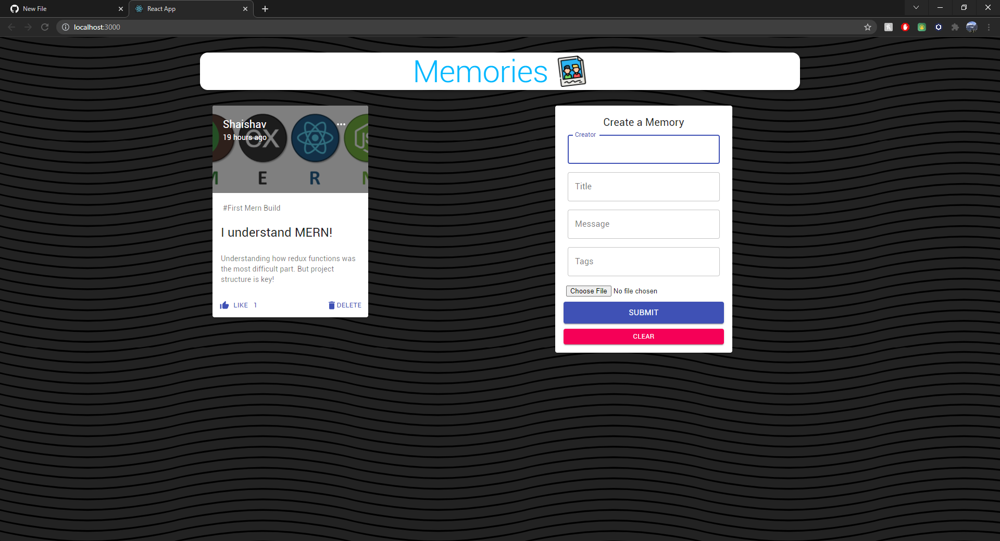

# MERN-Memories-Project

### Note: App is not currently deployed to heroku and netlify.

This project was built to help improve my understanding of the MERN stack.

This project, Memories, is a platform allowing users to 'create' a memory by filling out the required fields. 

Others viewing this site can see all the created memories as well as create their own. They can 'Like' or 'Delete' a memory ( since authorization is not yet implemented ).

The api is implemented using Express:

Create: --> Users can create posts

Read:   --> Users can read posts

Update: --> Can edit posts by clicking on the three-dots-icons

Delete: --> Can delete posts.

